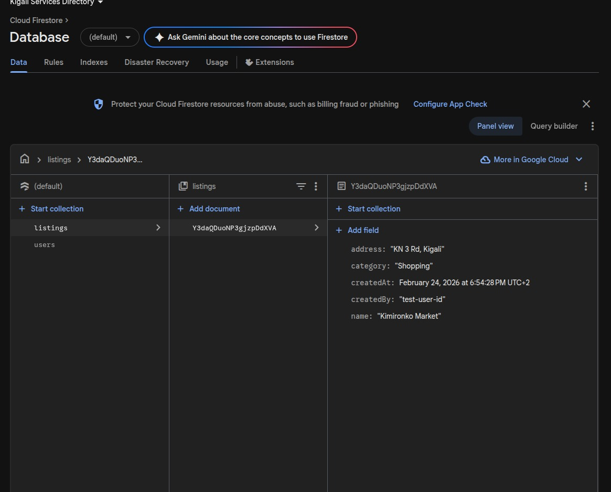
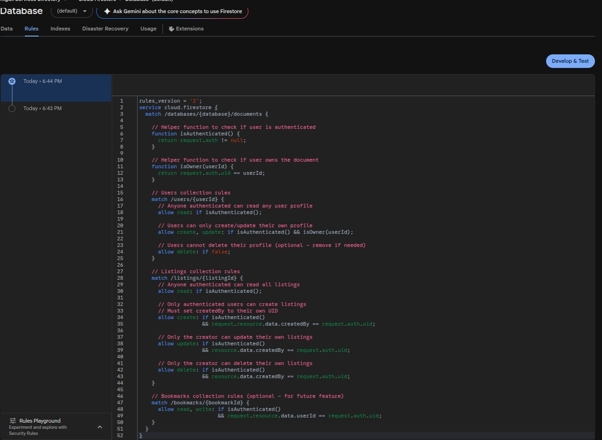

# Design Summary — Kigali City Services & Places Directory

**Student**: Hassan  
**Date**: March 8, 2026  
**Course**: Individual Assignment 2

---

## 1. Firestore Database Structure

The application uses two Firestore collections:

### `users` Collection
Each document is keyed by the Firebase Auth UID.

```
users/{uid}
├── email: string
├── displayName: string
├── createdAt: timestamp
└── notificationsEnabled: boolean (default: true)
```

A user document is created immediately after signup via `AuthService.signUp()`. The `notificationsEnabled` field is toggled from the Settings screen and persisted to Firestore so the preference follows the user across devices.

### `listings` Collection
Each document is auto-generated by Firestore with a unique document ID.

```
listings/{auto-id}
├── name: string              (e.g., "Kimironko Café")
├── category: string          (e.g., "Café", "Hospital", "Park")
├── address: string           (physical address)
├── contactNumber: string     (phone number)
├── description: string       (free-text description)
├── latitude: double          (geographic coordinate)
├── longitude: double         (geographic coordinate)
├── createdBy: string         (Firebase Auth UID of the creator)
├── createdAt: timestamp      (creation time)
└── updatedAt: timestamp      (last modification time)
```

**Security Rules**: Any authenticated user can read all listings and create new ones. Only the original creator (`createdBy == request.auth.uid`) can update or delete their own listings.

### Firebase Configuration Proof

| Service | Screenshot |
|---------|-----------|
| Authentication (Email/Password) |  |
| Firestore Database |  |
| Firestore Collections |  |
| Security Rules |  |

### Data Flow Diagram

```
┌─────────────────────────────────────────────────────────────────┐
│                     Cloud Firestore                             │
│  ┌───────────────┐              ┌────────────────────────────┐  │
│  │ users/{uid}   │              │ listings/{id}              │  │
│  │  email        │              │  name, category, address   │  │
│  │  displayName  │              │  contactNumber, description│  │
│  │  createdAt    │              │  latitude, longitude       │  │
│  │  notifications│              │  createdBy, timestamps     │  │
│  └───────┬───────┘              └─────────────┬──────────────┘  │
│          │                                    │                 │
└──────────┼────────────────────────────────────┼─────────────────┘
           │  Real-time streams                 │  Real-time streams
           │  (authStateChanges)                │  (snapshots)
           ▼                                    ▼
┌──────────────────────┐          ┌──────────────────────────────┐
│  AuthService         │          │  FirestoreService            │
│  - signUp()          │          │  - getAllListingsStream()    │
│  - signIn()          │          │  - getUserListingsStream()   │
│  - signOut()         │          │  - createListing()           │
│  - getUserProfile()  │          │  - updateListing()           │
│  - resendVerification│          │  - deleteListing()           │
└──────────┬───────────┘          └──────────────┬───────────────┘
           │                                     │
           ▼                                     ▼
┌──────────────────────┐          ┌──────────────────────────────┐
│  AuthProvider        │          │  ListingsProvider            │
│  (ChangeNotifier)    │          │  (ChangeNotifier)            │
│                      │          │                              │
│  States:             │          │  - _allListings              │
│  - loading           │          │  - _filteredListings         │
│  - authenticated     │          │  - _userListings             │
│  - unauthenticated   │          │  - _searchQuery              │
│  - needsVerification │          │  - _selectedCategory         │
│                      │          │  - search & filter logic     │
└──────────┬───────────┘          └──────────────┬───────────────┘
           │  Consumer<AuthProvider>              │  Consumer<ListingsProvider>
           ▼                                     ▼
┌────────────────────────────────────────────────────────────────┐
│                        UI Widgets                              │
│  AuthWrapper → LoginScreen / EmailVerificationScreen / App     │
│  DirectoryScreen (search + filter) │ MapViewScreen (markers)   │
│  MyListingsScreen (CRUD controls)  │ ListingDetailScreen       │
│  CreateListingScreen               │ EditListingScreen         │
│  SettingsScreen (profile + prefs)                              │
└────────────────────────────────────────────────────────────────┘
```

---

## 2. Listing Model Design

The `ListingModel` class (defined in `lib/models/listing_model.dart`) is the single data model for all service and place listings. It includes:

- **Firestore serialization**: `fromFirestore(DocumentSnapshot)` factory and `toFirestore()` method handle conversion between Dart objects and Firestore documents, including `Timestamp` ↔ `DateTime` mapping.
- **Geographic coordinates**: Stored as separate `latitude` and `longitude` doubles, which are passed directly to `google_maps_flutter` `LatLng` objects for marker placement and to `url_launcher` for turn-by-turn navigation URLs.
- **Ownership**: The `createdBy` field links each listing to a Firebase Auth UID, enabling the "My Listings" view and enforcing edit/delete permissions.

---

## 3. State Management Implementation

### Approach: Provider with ChangeNotifier

The app uses `MultiProvider` at the root (`main.dart`) to provide two `ChangeNotifier` instances:

| Provider | Responsibility |
|----------|---------------|
| `AuthProvider` | Subscribes to `authStateChanges` stream. Manages four auth states: `loading`, `authenticated`, `unauthenticated`, `needsVerification`. Exposes `signUp()`, `signIn()`, `signOut()`, and `reloadUser()` to the UI. |
| `ListingsProvider` | Subscribes to two Firestore real-time streams (all listings, user listings). Applies in-memory search (by name/description/address) and category filtering. Exposes `createListing()`, `updateListing()`, `deleteListing()`, `setSearchQuery()`, and `setCategory()`. |

### Key Design Decisions

1. **No Firebase calls in UI widgets** — All Firestore and Auth operations are in the service layer (`AuthService`, `FirestoreService`). UI widgets use `Consumer<>` and `Provider.of<>()` to read state and call methods on the providers.

2. **Real-time streams for automatic UI updates** — Both providers use Firestore `.snapshots()` streams. When a listing is created, updated, or deleted by any user, the streams emit new data, the providers update their internal lists, and `notifyListeners()` triggers UI rebuilds automatically.

3. **In-memory search and filtering** — Rather than querying Firestore for every search keystroke, `ListingsProvider` keeps all listings in memory and applies search/filter logic in `_applyFilters()`. This provides instant results and avoids Firestore read costs.

4. **Auth state listener suppression** — To prevent a race condition where the auth state listener fires before the sign-in verification check completes, a `_suppressAuthListener` flag temporarily blocks listener processing during `signIn()`.

---

## 4. Design Trade-offs and Technical Challenges

### Trade-off: In-Memory Filtering vs. Firestore Queries
- **Chosen**: Load all listings via a single stream, filter in memory
- **Alternative**: Use Firestore compound queries for each search/filter combination
- **Rationale**: Simpler code, instant filtering, no composite index requirements. For a city directory with hundreds of listings this is efficient. For millions of listings, server-side queries would be necessary.

### Trade-off: `getIdToken(true)` vs. `User.reload()`
- **Chosen**: Token refresh to check email verification status
- **Alternative**: `User.reload()` (standard approach)
- **Rationale**: `User.reload()` crashes due to a Pigeon serialization bug in `firebase_auth 4.x`. Using `getIdToken(true)` forces a token refresh that updates the local user object without triggering the buggy deserialization path. After upgrading to `firebase_auth 6.x`, both approaches work, but the `getIdToken` fallback remains as defensive code.

### Challenge: Firebase Auth Pigeon Type Cast Bug
The most significant challenge was the `PigeonUserDetails` / `PigeonUserInfo` type cast error (documented in Error #5 of the Error Documentation). The Firebase account was created successfully on the server, but the Dart client could not deserialize the response. This was resolved by upgrading `firebase_auth` from 4.x to 6.x and adding `TypeError` catch blocks as a safety net.

### Challenge: Email Verification Enforcement
Enforcing email verification required careful coordination between the auth state listener and the sign-in flow. The race condition (Error #6) was resolved by suppressing the listener during sign-in and manually updating state after the verification check completes.

### Challenge: Emulator Connectivity
The Android emulator (Pixel 9a, API 36) frequently disconnected from ADB during development. The solution was to restart ADB (`adb kill-server && adb start-server`), wait for full boot, and use `--device-timeout` flags. The emulator also had intermittent network issues resolving `firestore.googleapis.com` immediately after cold boot, which resolved after a few seconds.

---

## 5. Navigation Architecture

The app uses an `AuthWrapper` widget that listens to `AuthProvider` and routes to:
- `LoginScreen` → when `unauthenticated`
- `EmailVerificationScreen` → when `needsVerification`
- `BottomNavigation` → when `authenticated`

The `BottomNavigation` widget uses a `PageView` with four tabs:

| Index | Tab | Screen |
|-------|-----|--------|
| 0 | Home | `DirectoryScreen` — browse, search, and filter all listings |
| 1 | Map | `MapViewScreen` — Google Map with markers for all listings |
| 2 | My Listings | `MyListingsScreen` — user's own listings with edit/delete |
| 3 | Settings | `SettingsScreen` — profile, notifications toggle, logout |

Detail screens (`ListingDetailScreen`, `CreateListingScreen`, `EditListingScreen`) are pushed as full-screen routes via `Navigator.push()`.
