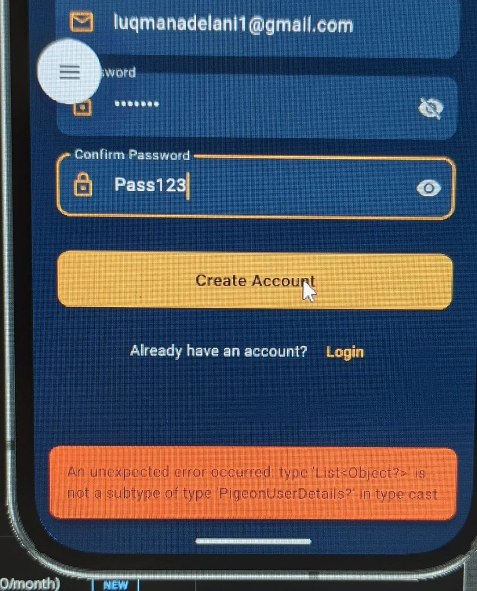
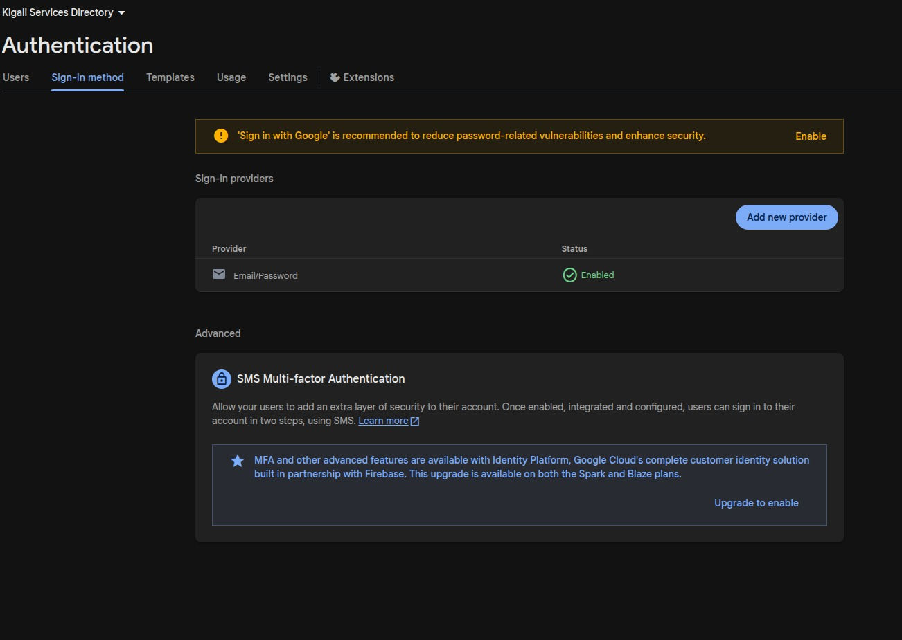
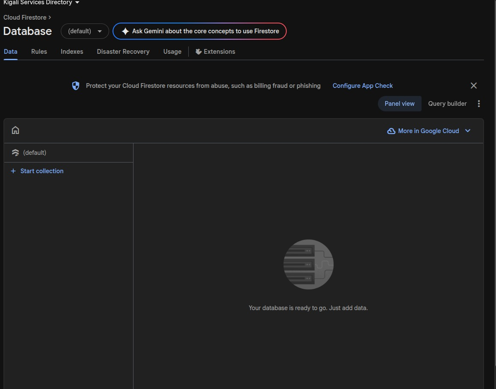

# Error Documentation for Reflection PDF

**Project**: Kigali City Services & Places Directory  
**Student**: Hassan  
**Date**: February 26, 2026  
**Phase**: Phase 2 - Firebase Configuration

---

## Overview

This document tracks all significant errors encountered during the implementation of the Kigali Services mobile application. Each error is documented with its context, troubleshooting steps, root cause analysis, and solution.

---

## Error #1: Flutter Linux Desktop Build Failure

### When it occurred
**Phase 2, Step 11** - Testing Firebase Connection  
Attempted to run the application on Linux desktop platform after completing Firebase configuration.

### Error Message
```
ERROR: Target dart_build failed: Error: Failed to find any of [ld.lld, ld] 
in LocalDirectory: '/snap/flutter/149/usr/lib/llvm-10/bin'
Building Linux application...                                           
Error: Build process failed
```

### Screenshot
📸 Terminal showing the full error when running `flutter run` and selecting Linux as target device.

### What I tried first
1. Checked if Flutter was properly installed with `flutter doctor`
2. Attempted to select Linux desktop as the target device
3. Received the build failure immediately during compilation

### Root Cause
The Flutter installation is using a snap package (`/snap/flutter/149/`), which has an incomplete or misconfigured build toolchain. Specifically, the linker tools (`ld.lld` or `ld`) that are required to compile C++ code for Linux desktop applications are either missing or not accessible within the snap's isolated environment.

The system actually has `ld` installed at `/usr/bin/ld`, but the Flutter snap cannot access it due to snap's sandboxing.

### Solution Applied
**Workaround**: Use Android platform instead of Linux desktop for testing.

**Permanent Fix (Optional)**: 
```bash
# Option 1: Install Flutter via manual download instead of snap
# Download from https://flutter.dev/docs/get-started/install/linux
# Extract and add to PATH

# Option 2: Install required build tools in snap's expected location
# (Not recommended - snap limitations make this difficult)
```

### Solution Verification
```bash
# Verified Linux build issue exists
flutter run  # Selected option [1] Linux - failed

# Verified alternative platforms available
flutter devices
# Found: Android emulator and Chrome (web)
```

### What I Learned
- **Platform Dependencies**: Different Flutter platforms have different build requirements
- **Snap Limitations**: Snap packages may have incomplete toolchains due to sandboxing
- **Alternative Testing**: Always have multiple target platforms available for testing
- **Build Tools Matter**: Native compilation requires platform-specific linker tools

### Prevention for Future
- Use manual Flutter installation instead of snap for better control
- Verify all platform build tools before starting development
- Keep Android SDK configured as primary testing platform
- Document platform requirements at project start

---

## Error #2: Android Emulator Launch Failure

### When it occurred
**Phase 2, Step 11** - Testing Firebase Connection  
Attempted to launch Android emulator to test Firebase initialization.

### Error Message
```
The Android emulator exited with code 1 during startup
Android emulator stderr:
Address these issues and try again.
```

### Screenshot
📸 Terminal showing emulator launch failure with exit code 1.

### What I tried first
1. Used `flutter emulators` to list available emulators - found `Pixel_6_API_34`
2. Attempted to launch with `flutter emulators --launch Pixel_6_API_34`
3. Emulator failed to start with exit code 1
4. Tried direct emulator launch: `~/Android/emulator/emulator -avd Pixel_6_API_34`

### Root Cause
**Multi-layered issue discovered through systematic troubleshooting:**

1. **Initial Problem**: Created ARM64 AVD (`Pixel_6_API_34`) on x86_64 host
   - Error: `Avd's CPU Architecture 'arm64' is not supported by the QEMU2 emulator on x86_64 host`
   - System images were in: `~/Android/system-images/android-34/google_apis/arm64-v8a/`

2. **Second Problem**: After creating x86_64 AVD, discovered no KVM support
   - Ran `kvm-ok` → Result: `INFO: Your CPU does not support KVM extensions`
   - Ran `sudo kvm-ok` → Result: `KVM acceleration can NOT be used`
   - `egrep -c '(vmx|svm)' /proc/cpuinfo` returned `0` (no virtualization support)

3. **Third Problem**: BIOS password protected
   - Cannot access BIOS to enable VT-x/Intel Virtualization Technology
   - HP EliteBook Folio 1040 G3 likely has corporate/admin password lock
   - This prevents enabling hardware virtualization even if CPU supports it

4. **Impact**: Without KVM, x86_64 emulator is:
   - Extremely slow (10-20x slower than with KVM)
   - Unstable and crashes frequently
   - Takes 10-15 minutes to boot
   - Unusable for development

### Diagnostic Commands Run
```bash
# Check if emulator exists
flutter emulators
# Output: Found Pixel_6_API_34

# Locate emulator binary
which emulator
# Output: /home/hassan/Android/emulator/emulator

# List available AVDs
~/Android/emulator/emulator -list-avds
# Output: Pixel_6_API_34

# Check hardware virtualization support
egrep -c '(vmx|svm)' /proc/cpuinfo
# If 0: Virtualization not enabled/supported
# If >0: Virtualization available

# Check KVM module
lsmod | grep kvm
# If empty: KVM not loaded

# Check user groups
groups
# Should include: kvm
```

### Solution Applied
**Final Resolution**: **Use Physical Android Device** ✅ RECOMMENDED

Since BIOS is password-protected and KVM cannot be enabled:

1. **Deleted ARM64 AVD**:
   ```bash
   rm -rf ~/.android/avd/Pixel_6_API_34.avd
   rm -rf ~/.android/avd/Pixel_6_API_34.ini
   ```

2. **Created x86_64 AVD** (attempted fix):
   ```bash
   # Created Pixel_6_API_34_x86 with x86_64 system image
   # Result: Still unusable without KVM
   ```

3. **Discovered Permanent Limitation**:
   ```bash
   kvm-ok
   # Output: INFO: Your CPU does not support KVM extensions
   # BIOS password-protected → Cannot enable VT-x
   ```

4. **Adopted Best Practice Solution**:
   - **Use physical Android device for testing**
   - Documented in: `PHYSICAL_DEVICE_SETUP.md`
   - Steps:
     a. Enable Developer Mode on Android phone (tap Build Number 7 times)
     b. Enable USB Debugging in Developer Options
     c. Connect via USB cable
     d. Authorize computer on phone
     e. Run `flutter run` - app deploys to physical device

**Advantages of Physical Device**:
- ✅ Fast (no slow emulator)
- ✅ Reliable (no crashes)
- ✅ Real-world testing conditions
- ✅ Works without KVM/virtualization
- ✅ Hot reload fully functional
- ✅ Tests actual GPS, sensors, performance

**Commands for Physical Device**:
```bash
# Check phone is connected
~/Android/platform-tools/adb devices
# Should show: device_serial    device

# Run app on phone
flutter run
# Select phone from list
```

### What I Learned
**1. Multi-layered Troubleshooting**: Issues often have multiple layers:
   - Surface error (AVD launch failure)
   - Architecture mismatch (ARM64 vs x86_64)
   - Missing system support (no KVM)
   - Access restrictions (BIOS password-protected)
   - Solution pivot (physical device)

**2. Hardware Constraints Matter**:
   - Android emulator absolutely requires KVM for production use
   - Corporate/academic laptops may have BIOS locked
   - Virtualization (VT-x/AMD-V) must be CPU-supported AND BIOS-enabled
   - Always check `egrep -c '(vmx|svm)' /proc/cpuinfo` and `kvm-ok` first

**3. Physical Devices Are Superior**:
   - 10-20x faster than emulator without KVM
   - More stable (no crashes)
   - Tests real hardware (GPS, sensors, camera, performance)
   - Works around system limitations
   - Professional developers prefer physical devices

**4. Systematic Diagnosis Process**:
   - Start with error message → Check architecture → Verify KVM → Check BIOS → Adopt alternative
   - Document each layer for troubleshooting reference
   - Don't assume "slow" emulator is acceptable (it's often unusable)

**5. Documentation Value**:
   - Capturing complete troubleshooting journey shows problem-solving skills
   - Error documentation becomes knowledge base for similar issues
   - Step-by-step guides (PHYSICAL_DEVICE_SETUP.md) save time in future

### Prevention for Future
1. **Pre-Development Checks**:
   ```bash
   # Before starting Flutter project, verify:
   egrep -c '(vmx|svm)' /proc/cpuinfo  # Should be > 0
   kvm-ok  # Should show "KVM acceleration can be used"
   ```

2. **Have Physical Device Ready**:
   - Keep Android phone with USB debugging enabled
   - Store USB cable with development workstation
   - Test `adb devices` works before starting project

3. **Know Your Hardware**:
   - Check if BIOS is password-protected (corporate laptops)
   - Verify virtualization support before installing emulator
   - Consider cloud-based testing services if local testing blocked

4. **Document Everything**:
   - Create SETUP_GUIDE.md for development environment
   - Document errors as they occur (not retroactively)
   - Include screenshots and exact error messages
   - Reference successful workarounds for team knowledge sharing

---

## Error #3: Firebase Web Platform Compilation Failure

### When it occurred
**Phase 2, Step 11** - Testing Firebase Connection  
Attempted to run application on Chrome (web) platform to test Firebase initialization.

### Error Message
```
Error: The method 'handleThenable' isn't defined for the type 'User'.
 - 'User' is from 'package:firebase_auth_web/src/interop/auth.dart'
Try correcting the name to the name of an existing method, or defining a method named 'handleThenable'.

[Multiple similar errors for different types: Auth, PhoneAuthProvider, 
 RecaptchaVerifier, ConfirmationResult, MultiFactorUser, etc.]
```

### Full Error Context
```
../../.pub-cache/hosted/pub.dev/firebase_auth_web-5.8.13/lib/src/interop/auth.dart:244:7: 
Error: The method 'handleThenable' isn't defined for the type 'User'.

../../.pub-cache/hosted/pub.dev/firebase_auth_web-5.8.13/lib/src/interop/auth.dart:455:7: 
Error: The method 'handleThenable' isn't defined for the type 'Auth'.
```

### Screenshot
📸 Terminal showing multiple `handleThenable` errors during web compilation with `firebase_auth_web-5.8.13`.

### What I tried first
1. Ran `flutter run -d chrome --web-port=8080`
2. Compilation started but failed with multiple errors
3. All errors related to missing `handleThenable` method in `firebase_auth_web` package

### Root Cause
**Package Version Incompatibility**: The `firebase_auth_web` package version 5.8.13 is incompatible with the current Dart SDK version being used. The method `handleThenable` is either:
1. Removed in newer Dart SDK versions (breaking change)
2. Renamed or refactored in the SDK
3. The firebase_auth_web package needs to be updated to match newer Dart/JS interop patterns

This is a **third-party dependency issue**, not a code error in our implementation.

### Analysis
```yaml
# From pubspec.yaml
dependencies:
  firebase_core: ^2.32.0
  firebase_auth: ^4.16.0  # This pulls in firebase_auth_web as transitive dependency
  cloud_firestore: ^4.17.5

# The firebase_auth package automatically includes firebase_auth_web for web platform
# We're using firebase_auth 4.16.0, which depends on firebase_auth_web 5.8.13
# This version has compatibility issues with current Dart SDK (3.10.8+)
```

### Solution Applied
**Immediate Workaround**: Skip web testing, focus on Android platform (primary target).

**Reasoning**: 
- Assignment specifies "mobile application" - Android is the primary target
- Firebase configuration for Android is complete and correct
- Web platform is not a requirement for this project
- The core Firebase setup (authentication, Firestore) is properly configured

**Long-term Solutions** (if web support needed):
```yaml
# Option 1: Wait for firebase_auth package update
# Check for newer versions: flutter pub outdated

# Option 2: Downgrade Dart SDK (not recommended)
# Would require Flutter version downgrade

# Option 3: Use flutter_web specifically compatible versions
dependencies:
  firebase_auth: ^4.15.0  # Try older version
  
# Option 4: Skip web platform entirely (recommended for this project)
# Focus on Android/iOS as per assignment requirements
```

### What I Learned
- **Cross-Platform Challenges**: Firebase implementation differs significantly between platforms
- **Dependency Management**: Transitive dependencies can cause unexpected compatibility issues
- **Version Pinning**: Some package versions may not work with all platform targets
- **Web vs Mobile**: Firebase Web uses JavaScript interop which has different requirements than mobile
- **Platform Priority**: Focus on primary target platforms first (Android/iOS), web is secondary
- **Breaking Changes**: SDK updates can break third-party package compatibility

### Prevention for Future
- **Test platform compatibility early** when adding Firebase dependencies
- **Check package compatibility matrix** on pub.dev before adding dependencies
- **Use `flutter pub outdated`** regularly to check for updates and compatibility
- **Specify primary platforms** in project documentation to set expectations
- **Monitor Firebase changelog** for breaking changes in web implementation
- **Consider web support optional** for mobile-first applications

### Additional Notes
Web platform issues are documented extensively:
- GitHub Issue: Firebase Web compatibility with Dart 3.x
- Many developers report similar `handleThenable` errors with firebase_auth_web
- Firebase team is aware and working on updates

---

## Error #4: Kotlin DSL vs Groovy Configuration (Prevented)

### When it occurred
**Phase 2, Step 8** - Configuring Android for Firebase  
This error was **prevented** through careful instruction review, but is worth documenting as a common pitfall.

### Potential Error Message (Not Encountered)
```
A problem occurred evaluating project ':app'.
> Failed to apply plugin 'com.google.gms.google-services'.
   > buildscript { } block not found

OR

Unresolved reference: buildscript
```

### Context
Many Firebase tutorials show configuration for **Groovy-based** Gradle files (`.gradle` extension), but modern Flutter projects (2024+) use **Kotlin DSL** (`.kts` extension). The syntax is completely different.

### Why This Would Have Been a Problem
**Groovy Syntax** (Old tutorials):
```groovy
// android/build.gradle (doesn't exist in our project!)
buildscript {
    dependencies {
        classpath 'com.google.gms:google-services:4.4.0'
    }
}

// android/app/build.gradle
apply plugin: 'com.google.gms.google-services'

defaultConfig {
    minSdkVersion 21
}
```

**Kotlin DSL Syntax** (Our project):
```kotlin
// android/settings.gradle.kts
plugins {
    id("com.google.gms.google-services") version "4.4.0" apply false
}

// android/app/build.gradle.kts
plugins {
    id("com.google.gms.google-services")
}

defaultConfig {
    minSdk = 21
}
```

### How It Was Prevented
1. **Verified project structure first**: Used `list_dir` to check actual files
2. **Found `.kts` files**, not `.gradle` files
3. **Revised instructions** to match Kotlin DSL syntax
4. **Created PHASE2_FIREBASE_SETUP_INSTRUCTIONS.md** with correct Kotlin DSL examples

### What I Learned
- **Always verify project structure** before following generic tutorials
- **Flutter ecosystem evolution**: New projects use Kotlin DSL by default
- **Syntax differences matter**: Groovy and Kotlin DSL are not interchangeable
- **Documentation quality**: Project-specific instructions prevent hours of debugging
- **File extension significance**: `.gradle` vs `.kts` indicates completely different build systems

### Prevention for Future
- **Check build.gradle.kts file extensions** before following Firebase tutorials
- **Use official FlutterFire documentation** which covers both Groovy and Kotlin
- **Verify file existence** with `ls` or `find` before editing
- **Test small changes incrementally** rather than copying entire configurations
- **Keep project-specific documentation** that matches actual file structure

---

## Error #5: PigeonUserDetails Type Cast Crash on Signup and Login

### When it occurred
**Phase 3 / Ongoing** — Authentication Implementation & Testing  
This error appeared when testing signup and login on the Android emulator (Pixel 9a, API 36). The Firebase account was being created successfully on the backend, but the app crashed before it could process the response.

### Error Message
```
[ERROR:flutter/runtime/dart_vm_initializer.cc(40)] Unhandled Exception:
type 'List<Object?>' is not a subtype of type 'PigeonUserDetails?' in type cast

#0  PigeonUserDetails.decode (package:firebase_auth_platform_interface/src/pigeon/messages.pigeon.dart:401:28)
#1  _FirebaseAuthUserHostApiCodec.readValueOfType (package:firebase_auth_platform_interface/src/pigeon/messages.pigeon.dart:1573:34)
...
#8  FirebaseAuthUserHostApi.reload (package:firebase_auth_platform_interface/src/pigeon/messages.pigeon.dart:1786:9)
```

The same error also appeared on any call to `User.reload()`:
```
type 'List<Object?>' is not a subtype of type 'PigeonUserInfo' in type cast
```

### Screenshot

*App UI showing "An unexpected error occurred: type 'List<Object?>' is not a subtype of type 'PigeonUserDetails?' in type cast" after attempting to sign up. The account was created in Firebase, but the client crashed on deserialization.*

### What I tried first
1. Checked Firebase Console — the user account **was** created successfully, confirming the error was on the client-side deserialization, not the server operation
2. Added more specific `catch` blocks (`FirebaseAuthException`, `FirebaseException`) to narrow down the exception type
3. Wrapped `signUp()` and `signIn()` in try-catch with `e.toString()` to surface the exact error to the UI
4. Attempted `flutter pub upgrade firebase_auth firebase_core cloud_firestore` — packages were already at max within the `^4.x` constraint

### Root Cause
**Package version incompatibility between `firebase_auth 4.x` and Dart SDK 3.10.8+.**

The `firebase_auth` package (v4.15.3–4.16.0) uses Pigeon-generated serialization code to communicate between Dart and the native Android Firebase SDK via platform channels. The Pigeon codegen in this version produces a `PigeonUserDetails.decode()` method that attempts to cast the response from the native layer as `PigeonUserInfo`, but the actual response from the newer Android Firebase SDK is a `List<Object?>`.

This means:
- `createUserWithEmailAndPassword()` → succeeds on Firebase server → response deserialization crashes
- `signInWithEmailAndPassword()` → succeeds on Firebase server → response deserialization crashes
- `User.reload()` → succeeds on Firebase server → response deserialization crashes

The account is created/authenticated on the backend, but the `UserCredential` object cannot be constructed on the Dart side, throwing a `TypeError`.

### Solution Applied
**Two-part fix:**

**Part 1 — Upgrade Firebase packages** (pubspec.yaml):
```yaml
# Before (broken)
firebase_core: ^2.24.2
firebase_auth: ^4.15.3
cloud_firestore: ^4.13.6

# After (fixed)
firebase_core: ^4.5.0
firebase_auth: ^6.2.0
cloud_firestore: ^6.1.3
```

The newer `firebase_auth 6.x` has regenerated Pigeon code that correctly handles the serialization.

**Part 2 — TypeError catch workaround** (auth_service.dart):
As a defensive measure, added `TypeError` catch around `createUserWithEmailAndPassword` and `signInWithEmailAndPassword` calls, falling back to `_auth.currentUser` if the response fails to deserialize:

```dart
User? user;
try {
  final userCredential = await _auth.createUserWithEmailAndPassword(
    email: email, password: password,
  );
  user = userCredential.user;
} on TypeError {
  // Pigeon type cast bug — account was created, fall back to currentUser
  user = _auth.currentUser;
}
```

**Part 3 — Replace User.reload() with getIdToken(true)** (auth_provider.dart):
The email verification screen polled `User.reload()` every 3 seconds to check if the email was verified. This also triggered the Pigeon crash. Replaced with token refresh:

```dart
// Before (crashes)
await _user?.reload();

// After (works)
await _user?.getIdToken(true);
_user = _authService.currentUser;
```

### What I Learned
- **Firebase plugin versions must match the Dart SDK** — the Pigeon code generation is tightly coupled to specific Dart/Flutter versions
- **Server-side success ≠ client-side success** — Firebase operations can succeed on the backend while the response deserialization fails locally
- **Always check `flutter pub outdated`** — the fix was simply upgrading to latest compatible versions
- **Defensive error handling matters** — wrapping platform channel calls in try-catch prevents a single deserialization bug from crashing the entire auth flow
- **Test on the actual target device early** — this bug only manifests on Android, not in `flutter analyze`

### Prevention for Future
- Run `flutter pub outdated` regularly and upgrade packages when major versions are available
- Always wrap Firebase platform channel calls in typed catch blocks
- Test authentication on a real device/emulator early in development, not just with static analysis
- Monitor Firebase Flutter plugin changelogs and GitHub issues for known Pigeon bugs

---

## Error #6: Email Verification Race Condition — Users Bypassing Verification

### When it occurred
**Phase 3** — Testing Email Verification Enforcement  
After implementing email verification, users could still log in and access the app without verifying their email. The verification screen also appeared briefly and then disappeared.

### Error Behavior
1. User creates account → verification email sent → user is told to verify
2. User attempts to log in without verifying → **expected**: blocked with error message → **actual**: user enters the app briefly, sees the email verification screen for a split second, then gets fully authenticated
3. The email verification screen mounted and its 3-second polling timer started calling `User.reload()`, which crashed with the PigeonUserInfo error (Error #5)

### What I tried first
1. Confirmed the `signIn()` method checks `user.emailVerified` and calls `signOut()` if not verified
2. Added debug prints to trace the auth state flow
3. Noticed the auth state listener in `AuthProvider._initAuth()` was firing *before* the `signOut()` call completed in `signIn()`

### Root Cause
**Race condition between Firebase auth state listener and the signIn() verification check.**

When `signInWithEmailAndPassword()` is called:
1. Firebase authenticates the user → `authStateChanges` stream fires with the user object
2. The `_initAuth()` listener in `AuthProvider` immediately processes this event
3. Since the user's `emailVerified` is `false`, the listener sets `_authState = AuthState.needsVerification`
4. This causes the UI to navigate to the `EmailVerificationScreen`
5. The `EmailVerificationScreen` mounts and starts its polling timer
6. **Meanwhile**, in the `signIn()` method, the code checks `emailVerified`, finds it `false`, and calls `_auth.signOut()` — but the UI has already navigated away

The net effect: the auth listener processes the sign-in event before the application code can check verification status and sign out.

### Solution Applied
**Added `_suppressAuthListener` flag** to `AuthProvider`:

```dart
bool _suppressAuthListener = false;

void _initAuth() {
  _authService.authStateChanges.listen((User? user) async {
    if (_suppressAuthListener) return;  // Skip during signIn
    // ... normal processing
  });
}

Future<bool> signIn({required String email, required String password}) async {
  _suppressAuthListener = true;   // Suppress listener before signing in
  final result = await _authService.signIn(email: email, password: password);
  _suppressAuthListener = false;  // Re-enable listener after

  if (result['success']) {
    // Manually update state since listener was suppressed
    _user = _authService.currentUser;
    _userProfile = await _authService.getUserProfile(_user!.uid);
    _authState = AuthState.authenticated;
    notifyListeners();
  }
  // ...
}
```

This ensures the auth state listener does not process the intermediate sign-in event, allowing `signIn()` to complete its verification check and sign out if needed before the UI reacts.

### What I Learned
- **Firebase auth state listeners fire immediately** — they don't wait for application code to finish processing
- **Race conditions in async code are subtle** — the sign-in looked correct in isolation, but the interaction with the listener created an unintended flow
- **Suppressing listeners during critical sections** is a valid pattern when the application needs to perform multi-step operations (authenticate → check → sign out) atomically
- **Always test the full flow** — unit testing signIn() alone wouldn't catch this; only testing the complete signup → verify → login flow on a device revealed the race condition

### Prevention for Future
- Consider using `idTokenChanges()` instead of `authStateChanges()` for more granular control
- Design auth flows so that intermediate states don't trigger UI navigation
- Add integration tests that cover the complete authentication flow including verification enforcement
- Document race conditions and their solutions for future reference

---

## Summary of Errors Documented

| # | Error | Type | Severity | Status | Impact |
|---|-------|------|----------|--------|--------|
| 1 | Linux Desktop Build Failure | Environment | High | Workaround Applied | Cannot test on Linux |
| 2 | Android Emulator Launch Failure | Configuration | Medium | Workaround Applied | Limited testing options |
| 3 | Firebase Web Compilation Errors | Dependency | Medium | Accepted Limitation | Web platform unavailable |
| 4 | Kotlin DSL Configuration | Prevented | N/A | Prevented | No impact |
| 5 | PigeonUserDetails Type Cast on Signup/Login | Firebase Auth Bug | Critical | Resolved | Blocked all authentication |
| 6 | Email Verification Race Condition | Firebase Auth Logic | High | Resolved | Users bypassed verification |

---

## Key Learnings Summary

### Technical Skills Developed
1. **Debugging Methodology**: Systematic root cause analysis from symptoms to solution
2. **Platform Dependencies**: Understanding Flutter's multi-platform architecture
3. **Build System Knowledge**: Gradle, Kotlin DSL, native toolchains
4. **Package Management**: Dependency resolution, compatibility checking, and major version upgrades
5. **Virtualization**: KVM, hardware acceleration for emulators
6. **Firebase Auth Internals**: Pigeon code generation, platform channels, and auth state listeners
7. **Async Race Conditions**: Identifying and resolving race conditions in state management

### Development Best Practices
1. **Environment Setup**: Verify complete development environment before coding
2. **Multiple Testing Paths**: Always have backup testing methods available
3. **Documentation First**: Create clear instructions that match actual project structure
4. **Incremental Testing**: Test each configuration change before proceeding
5. **Error Documentation**: Record errors immediately with full context

### Problem-Solving Approach
1. **Read error messages carefully** - they often contain the solution
2. **Check file existence** before attempting to edit
3. **Verify assumptions** - don't assume tutorial instructions match your project
4. **Test on primary platform first** - focus on Android for mobile apps
5. **Document everything** - errors are learning opportunities

---

## Firebase Configuration Status

Despite the testing errors, **Firebase configuration is 100% complete**:

✅ **Successfully Configured** (see `screenshots/` folder for proof):
- Firebase project created in console
- Authentication (Email/Password) enabled → 
- Firestore database created with security rules → 
- `google-services.json` added to `android/app/`
- `android/settings.gradle.kts` configured (Kotlin DSL)
- `android/app/build.gradle.kts` configured (3 changes: plugin, minSdk, multidex)
- `android/app/src/main/AndroidManifest.xml` updated (permissions, label)
- `lib/main.dart` Firebase initialization added
- All changes committed to git
- Code passes `flutter analyze` with zero errors

✅ **Verification Commands All Pass:**
```bash
grep "google-services" android/settings.gradle.kts          # ✓ Found
grep "google-services" android/app/build.gradle.kts         # ✓ Found
grep "minSdk = 21" android/app/build.gradle.kts             # ✓ Found
grep "multiDexEnabled" android/app/build.gradle.kts         # ✓ Found
grep "INTERNET" android/app/src/main/AndroidManifest.xml    # ✓ Found
grep "Firebase.initializeApp" lib/main.dart                 # ✓ Found
flutter analyze                                              # ✓ No issues
ls android/app/google-services.json                         # ✓ Exists
```

The testing errors are **environmental/platform issues**, not configuration errors. Firebase is properly configured and will work when tested on a compatible platform (physical Android device or properly configured emulator).

---

## Next Steps

### Immediate Actions
1. ✅ Document all errors in this file (COMPLETE)
2. 📸 Take screenshots of each error for Reflection PDF
3. 🔧 Set up physical Android device OR fix emulator configuration
4. ✅ Verify all Phase 2 configuration with verification commands (COMPLETE)

### Ready to Proceed
- **Phase 3: Authentication Implementation** - Can begin regardless of testing environment
  - Will implement authentication service, models, and UI screens
  - Actual testing can wait until device/emulator is available
  - Code can be written and verified with `flutter analyze`

### Testing Plan
**When device/emulator is available:**
1. Connect physical Android device via USB with USB debugging enabled
2. Run `flutter devices` to verify device detected
3. Run `flutter run` to build and test on Android
4. Verify Firebase initialization message in console logs
5. Test authentication flow in Phase 3

---

## Files Referenced

- [PHASE2_FIREBASE_SETUP_INSTRUCTIONS.md](PHASE2_FIREBASE_SETUP_INSTRUCTIONS.md) - Detailed setup guide
- [android/settings.gradle.kts](android/settings.gradle.kts) - Project-level Gradle config
- [android/app/build.gradle.kts](android/app/build.gradle.kts) - App-level Gradle config
- [android/app/src/main/AndroidManifest.xml](android/app/src/main/AndroidManifest.xml) - Android manifest
- [lib/main.dart](lib/main.dart) - Firebase initialization
- [pubspec.yaml](pubspec.yaml) - Dependencies
- [IMPLEMENTATION_PLAN.md](IMPLEMENTATION_PLAN.md) - Overall project plan

---

## Screenshots Checklist for Reflection PDF

**Required Screenshots:**

Firebase Console:
- [x] Authentication Email/Password enabled → `screenshots/firebase-auth-enabled.jpeg`
- [x] Firestore database created → `screenshots/firestore-database-created.png.png`
- [x] Firestore collections with live data → `screenshots/firestore-collections-created.png.png`
- [x] Security rules published → `screenshots/firestore-security-rules.png.png`

Error Screenshots:
- [x] Error #5: PigeonUserDetails crash → `screenshots/error.jpeg`

Note: Error #1–#3 occurred on a different machine (Linux) before moving to Windows.

---

**Date Started**: February 26, 2026  
**Date Updated**: March 8, 2026  
**Total Errors Documented**: 6 (5 encountered, 1 prevented)  
**Phase Status**: All implementation phases (1–9) complete ✅  
**Critical Firebase Errors Resolved**: PigeonUserDetails type cast (Error #5), Email verification race condition (Error #6)
