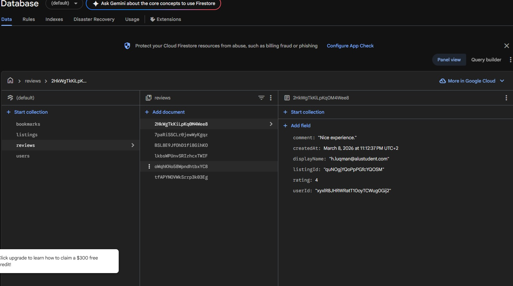
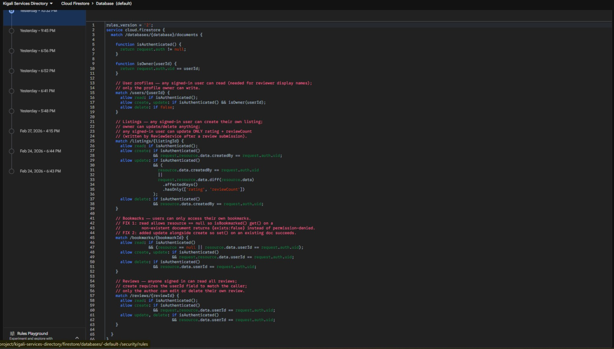

# Kigali City Services & Places Directory

A Flutter mobile application that helps Kigali residents locate and navigate to essential public services and leisure locations — hospitals, police stations, libraries, restaurants, cafés, parks, and tourist attractions. Built with Firebase Authentication, Cloud Firestore, Google Maps, and the Provider state management pattern.

---

## Features

- **Authentication** — Sign up, log in, and log out using Firebase Authentication. Email verification is enforced before users can access the app. Each user has a profile stored in Firestore.
- **Location Listings (CRUD)** — Create, read, update, and delete service listings stored in Cloud Firestore. All changes reflect in real time across the app.
- **Directory View** — Browse all listings with real-time search (by name, description, or address) and category filter chips. When device location is available, listings are sorted by distance and a "Near You" heading is shown.
- **My Listings** — View and manage only your own listings.
- **Map View** — Interactive Google Map showing all listings as markers. Tap a marker to preview the listing and navigate to the detail page.
- **Listing Detail** — Full listing information with an optional hero image, an embedded Google Map, a "Get Directions" button (launches Google Maps turn-by-turn navigation), a direct phone call shortcut, the listing's average star rating, and a link to the full reviews screen.
- **Reviews & Ratings** — Authenticated users can submit a 1–5 star rating with an optional comment for any listing. The listing's average rating and review count update automatically. Users can edit their own review. Reviews are displayed on a dedicated Reviews screen.
- **Bookmarks** — Save any listing with a single tap on the bookmark icon. Bookmarked listings appear on the dedicated Bookmarks tab and can be sorted A–Z or by most recent. Bookmarks persist to Firestore and sync across sessions.
- **Distance Display** — When location permission is granted, each listing card shows its distance from the user in kilometres and the directory sorts listings nearest-first.
- **Settings** — Displays your profile (name, email, member since), email verification status, a notification toggle that persists to your Firestore profile, and logout.

---

## Firestore Database Structure

### `users` collection
| Field | Type | Description |
|-------|------|-------------|
| `uid` | string | Firebase Auth user ID (document ID) |
| `email` | string | User email address |
| `displayName` | string | Display name entered at signup |
| `createdAt` | timestamp | Account creation date |
| `notificationsEnabled` | boolean | Notification preference (default: true) |

### `listings` collection
| Field | Type | Description |
|-------|------|-------------|
| `name` | string | Place or service name |
| `category` | string | Category (e.g., Hospital, Café, Park) |
| `address` | string | Physical address |
| `contactNumber` | string | Phone number |
| `description` | string | Full description |
| `latitude` | double | Geographic latitude |
| `longitude` | double | Geographic longitude |
| `createdBy` | string | UID of the user who created the listing |
| `createdAt` | timestamp | Creation timestamp |
| `updatedAt` | timestamp | Last update timestamp |
| `rating` | double | Average rating (updated by ReviewService) |
| `reviewCount` | int | Total number of reviews |
| `imageUrl` | string? | Optional hero image URL |

### `reviews` collection
| Field | Type | Description |
|-------|------|-------------|
| `listingId` | string | ID of the reviewed listing |
| `userId` | string | UID of the reviewer |
| `displayName` | string | Reviewer's display name (denormalised) |
| `rating` | int | Star rating 1–5 |
| `comment` | string | Optional review comment |
| `createdAt` | timestamp | Submission timestamp |

### `bookmarks` collection
| Field | Type | Description |
|-------|------|-------------|
| `userId` | string | UID of the user |
| `listingId` | string | ID of the bookmarked listing |
| `createdAt` | timestamp | Bookmark creation timestamp |

> Document IDs for bookmarks use the compound format `{userId}_{listingId}`, preventing duplicate bookmarks and enabling O(1) toggle operations without a query.

---

## State Management Architecture

Provider pattern is used throughout. No Firebase SDK calls are made directly from UI widgets.

```
Firestore / Firebase Auth
         ↓
  Service Layer
  ├── AuthService        (lib/services/auth_service.dart)
  ├── FirestoreService   (lib/services/firestore_service.dart)
  ├── ReviewService      (lib/services/review_service.dart)
  └── BookmarkService    (lib/services/bookmark_service.dart)
         ↓
  Provider Layer
  ├── AuthProvider       (lib/providers/auth_provider.dart)
  ├── ListingsProvider   (lib/providers/listings_provider.dart)
  ├── ReviewsProvider    (lib/providers/reviews_provider.dart)
  └── BookmarksProvider  (lib/providers/bookmarks_provider.dart)
         ↓
  UI Widgets (lib/screens/)
```

- **AuthProvider** — manages authentication state (`loading`, `authenticated`, `unauthenticated`, `needsVerification`), exposes the current user and user profile, and subscribes to `authStateChanges`.
- **ListingsProvider** — subscribes to Firestore real-time streams for all listings and the current user's listings, applies in-memory search and category filters, integrates device location for distance sorting, and exposes CRUD methods to the UI.
- **ReviewsProvider** — subscribes to a real-time stream of reviews for the currently viewed listing, manages submit/update state, and exposes `submitReview()` to the UI.
- **BookmarksProvider** — subscribes to a real-time stream of the user's bookmarked listing IDs, exposes `toggle()`, and provides a filtered list of bookmarked `ListingModel` objects by joining with `ListingsProvider`.

---

## Navigation Structure

A `BottomNavigationBar` with five tabs:

| Tab | Screen | Description |
|-----|--------|-------------|
| Home | Directory | Browse all listings with search and category filters |
| Map | Map View | Interactive map with markers for all listings |
| My Listings | My Listings | Listings created by the authenticated user |
| Bookmarks | Bookmarks | Listings saved by the authenticated user |
| Settings | Settings | Profile info, notification toggle, logout |

---

## Project Structure

```
lib/
├── main.dart                        # App entry point, Provider setup, AuthWrapper routing
├── models/
│   ├── listing_model.dart           # Listing data model with Firestore serialization
│   ├── review_model.dart            # Review data model with Firestore serialization
│   └── user_model.dart              # User profile model
├── services/
│   ├── auth_service.dart            # Firebase Auth + Firestore user operations
│   ├── firestore_service.dart       # Firestore CRUD + real-time streams for listings
│   ├── review_service.dart          # Review CRUD + listing rating recalculation
│   └── bookmark_service.dart        # Bookmark toggle + real-time stream
├── providers/
│   ├── auth_provider.dart           # Authentication state management
│   ├── listings_provider.dart       # Listings state, filtering, distance sort, CRUD
│   ├── reviews_provider.dart        # Reviews state, submit/update flow
│   └── bookmarks_provider.dart      # Bookmarks state, toggle, filtered listing list
├── screens/
│   ├── auth/
│   │   ├── login_screen.dart
│   │   ├── signup_screen.dart
│   │   └── email_verification_screen.dart
│   ├── home/
│   │   ├── directory_screen.dart    # Listing directory with search, filters, distance
│   │   └── map_view_screen.dart     # Google Maps with all listing markers
│   ├── listings/
│   │   ├── create_listing_screen.dart
│   │   ├── edit_listing_screen.dart
│   │   ├── listing_detail_screen.dart
│   │   ├── my_listings_screen.dart
│   │   ├── reviews_screen.dart      # Full reviews list for a listing
│   │   └── rate_listing_screen.dart # Star rating + comment submission form
│   ├── bookmarks/
│   │   └── bookmarks_screen.dart    # Saved listings with A–Z sort toggle
│   └── settings/
│       └── settings_screen.dart
├── widgets/
│   └── listing_card.dart            # Reusable listing card (distance, bookmark icon)
├── navigation/
│   └── bottom_navigation.dart       # Bottom nav bar with PageView (5 tabs)
└── utils/
    ├── constants.dart               # App constants, category list, collection names
    ├── theme.dart                   # Dark theme with gold accent
    └── validators.dart              # Form field validators
```

---

## Tech Stack

| Layer | Technology |
|-------|-----------|
| Framework | Flutter 3.x / Dart SDK 3.10.8+ |
| Authentication | Firebase Authentication 6.x |
| Database | Cloud Firestore 6.x |
| State Management | Provider 6.x |
| Maps | google_maps_flutter 2.14.x |
| Location | geolocator 14.x, geocoding 4.x |
| Navigation | url_launcher 6.x |
| Image loading | cached_network_image 4.x |
| Local storage | shared_preferences 2.x |

---

## Setup Instructions

### Prerequisites
- Flutter SDK 3.10 or higher
- Android Studio or VS Code with Flutter/Dart plugins
- A Firebase project with Authentication and Firestore enabled
- A Google Maps API key with the Maps SDK for Android (and iOS) enabled

### 1. Clone the repository
```bash
git clone <repository-url>
cd individual_assignment_2
```

### 2. Install dependencies
```bash
flutter pub get
```

### 3. Firebase Configuration

1. Go to the [Firebase Console](https://console.firebase.google.com/) and create a project.
2. Add an Android app (package name: `com.example.individual_assignment_2`).
3. Download `google-services.json` and place it in `android/app/`.
4. In the Firebase Console, enable **Authentication → Email/Password**.
5. Create a **Cloud Firestore** database in production mode.
6. Publish the following Firestore security rules:

```
rules_version = '2';
service cloud.firestore {
  match /databases/{database}/documents {

    function isAuthenticated() {
      return request.auth != null;
    }

    function isOwner(userId) {
      return request.auth.uid == userId;
    }

    match /users/{userId} {
      allow read: if isAuthenticated();
      allow create, update: if isAuthenticated() && isOwner(userId);
      allow delete: if false;
    }

    match /listings/{listingId} {
      allow read: if isAuthenticated();
      allow create: if isAuthenticated()
                    && request.resource.data.createdBy == request.auth.uid;
      allow update: if isAuthenticated()
                    && (
                      resource.data.createdBy == request.auth.uid
                      ||
                      request.resource.data.diff(resource.data)
                        .affectedKeys()
                        .hasOnly(['rating', 'reviewCount'])
                    );
      allow delete: if isAuthenticated()
                    && resource.data.createdBy == request.auth.uid;
    }

    match /bookmarks/{bookmarkId} {
      allow read: if isAuthenticated()
                  && (resource == null || resource.data.userId == request.auth.uid);
      allow create, update: if isAuthenticated()
                            && request.resource.data.userId == request.auth.uid;
      allow delete: if isAuthenticated()
                    && resource.data.userId == request.auth.uid;
    }

    match /reviews/{reviewId} {
      allow read: if isAuthenticated();
      allow create: if isAuthenticated()
                    && request.resource.data.userId == request.auth.uid;
      allow update, delete: if isAuthenticated()
                            && resource.data.userId == request.auth.uid;
    }
  }
}
```

### 4. Google Maps API Key

**Android:** Open `android/app/src/main/AndroidManifest.xml` and replace the existing API key value:
```xml
<meta-data
    android:name="com.google.android.geo.API_KEY"
    android:value="YOUR_API_KEY_HERE"/>
```

### 5. Run the application
```bash
flutter run
```

---

## Firebase Integration Proof

The following screenshots demonstrate that the app is connected to and actively using Firebase services:

### Firebase Authentication Enabled

*Firebase Console showing Email/Password authentication provider is enabled for this project.*

### Firestore Database Created

*Firebase Console showing the Cloud Firestore database has been created and is active.*

### Firestore Collections Created

*Firestore Console showing the `users`, `listings`, `bookmarks`, and `reviews` collections with live data.*

### Firestore Security Rules

*Firestore security rules published — covering all four collections with per-user access control.*

---

## Author

Hassan — Individual Assignment 2
GitHub: [Hassan-Adelani-Luqman/individual_assignment_2](https://github.com/Hassan-Adelani-Luqman/individual_assignment_2)
